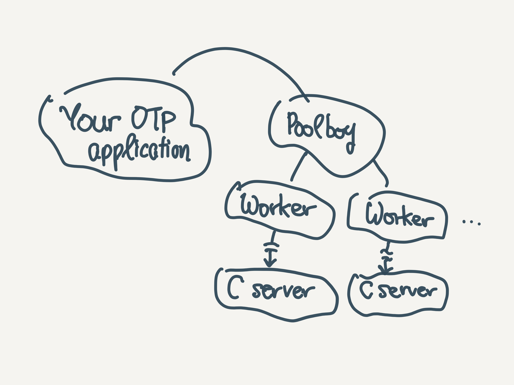

# Supervised Scaler

The Supervised Scaler is an Elixir/Phoenix project made to support [my lightning talk](https://www.icloud.com/keynote/0-4TNF2RqhabO9t6GIfgV3djw) at [Elixir London 2016](http://www.elixir.london). It is laid out thusly:

1.  A simple Phoenix application, `scaler`, which generates thumbnails using a local dependency.
2.  The local dependency, `resampler` which contains an Elixir wrapper around a C server, which calls libVIPS.
3.  Another sample implementation which uses the excellent `mogrify` library that renders a reference thumbnail.

This project is considered alpha quality and should not yet be used in production systems, because I have not fulfilled items listed under **Help Wanted.** If you are willing to use this in production, though, I’d like to read your crash logs.

## Why?

1.  libVIPS has much better [resource use](http://www.vips.ecs.soton.ac.uk/index.php?title=Speed_and_Memory_Use) and competes favourably against other popular solutions.
2.  libVIPS is [quite well-designed](http://www.vips.ecs.soton.ac.uk/index.php?title=How_it_works) in my own opinion.
3.  I have not yet seen another Erlang/Elixir/Phoenix thumbnail generation library that makes me say “that sounds like a great idea” and I felt that the community should have one of these things.
4.  A chance to write some more C code and let that code just crash.

## High Level Structure

To be brief, the C API for libVIPS is used and a [C program](deps_local/resampler/c_src/convert.c) listens on STDIN for image resampling requests. Each request uses a full line with a line break at the end, which is incidentally also the unit of work read in by the C program. The program then attempts to locate the file, resize it, allocate a temporary file path and write the output into that path. Once done the program emits the path via STDOUT; in case of any error exactly one message will be logged via STDERR.

This C program is then run under [erlexec](https://github.com/saleyn/erlexec) from a GenServer and that is further mediated by [poolboy](https://github.com/devinus/poolboy). I then configure `erlexec` to use `run_link` so any sort of segmentation fault or other unsavoury business in the C program simply causes the entire thing to die and be replaced with another fresh worker by poolboy.

Then I put in an interface which checks out a process from `poolboy` and calls the resultant GenServer in question, asking for it to convert a file. The GenServer then sends a message to the C server via `erlexec` in STDIN and uses a nested `receive` to glean whatever response provided, and ultimately pass that piece of information back to the caller.

I believe that this is the most straightforward solution to deliver a solution that is fast (it is quite hard to beat libVIPS), simple (even the C server does not need defensive programming any more, since if it crashes a new one replaces it anyway), and straightforward to use (the public API uses a single call).

## How to run the app

1.  Get a proper version of Erlang/OTP
2.  Get a proper version of Elixir, I’ve used 1.3.2 via kiex
3.  Make sure you have some sort of compiler in place
4.  Make sure you have libVIPS in place and `pkg-config` reports it properly. See: `pkg-config --libs --cflags vips`.
5.  Run the application.

## How to transplant this library to your app

1.  Grab the local dependency `resampler` from `deps_local`. (Note: once we have a proper entry in the package manager this will change.)
2.  Make sure you have `Resampler.Pool` as part of your application’s supervision tree.
3.  Use the library as usual: `{:ok, file_path} = Resampler.request(path, maxWidth, maxHeight)`.

## Help needed?

Open an Issue and I’ll look at them whenever I can.

## Help wanted

1.  Sort out STDERR / STDOUT separation in `erlexec` vs. `pty` vs. `fgets`. See [issue in erlexec](https://github.com/saleyn/erlexec/issues/41).
2.  Proper dependency extraction, packaging and publication to make this into a real dependency worthy of a place in your `mix.exs`.
3.  A more comprehensive performance benchmarking to understand what sort of overhead is incurred by the current solution.
4.  Once #2 is done, a more proper documentation scheme to be put in place.
5.  Embed a nonce in each request so there is no chance of any sort of output being mixed up.
6.  In case the libVIPS process is taking longer than expected, it should be killed by the worker which will trigger graceful process replacement
7.  Think about whether the project wants to just make thumbnails or if it also wants to do something else.
8.  Additional promotion.

## References

* [Elixir Native Interoperability – Ports vs. NIFs](https://spin.atomicobject.com/2015/03/16/elixir-native-interoperability-ports-vs-nifs/)
* [saleyn/erlexec](https://github.com/saleyn/erlexec) and [documentation](http://saleyn.github.io/erlexec/)
* [antipax/exexec](https://github.com/antipax/exexec) which is a wrapper around `erlexec`
* [devinus/poolboy](https://github.com/devinus/poolboy) a good connection pool implementation
* [rramsden/mogrify](https://github.com/rramsden/mogrify) a wrapper around `mogrify` for use in Elixir
